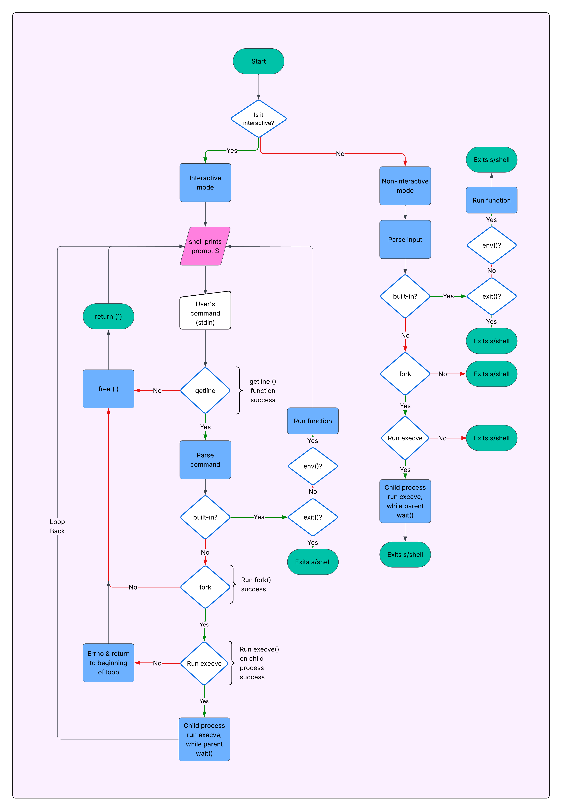

# Simple Shell Project
This repository contains the Simple Shell group project completed as part of Holberton School's C27 curriculum.

## Description
A shell is a command-line interpreter that allows users to interact with an operating system by executing commands.
This simple shell provides a stripped-back version of that environment, mimicing its behaviour in a limited form.

The shell:
- Displays a prompt and waits for user input
- Tokenises commands and arguments
- Searches for executables in the system `PATH`
- Creates a child process to execute commands
- Supports a small set of built-in commands:
	- `exit` - exits the shell with the status of the last executed command
	- `env` - prints the current environment variables and their values  

Flowchart example:

## Usage
The shell is compiled using the following:
`gcc -Wall -Werror -Wextra -pedantic -std=gnu89 *.c -o hsh`

Interactive Mode
| Specifier | Description                      |
|-----------|----------------------------------|
| `./hsh`   | Launch shell prompt              |
| `ls -l`   | List files in long format        |
| `env`     | Show environment variables       |
| `exit`    | Exit shell session               |

None-Interactive Mode:
| Command                  | Description                               |
|--------------------------|----------------------------|
| `echo "ls -l" | ./hsh`   | Run command without prompt |

## Files
- `main.c` - main shell loop
- `_which.c` - custom implementation of `which` function
- `_getenv.c` - custom implementation of `getenv` function
- `launch_exec_child.lt_ins.c` - implementation of inbuilt commands
- `shell.h` - header file with prototypes and macros

## License

[MIT License](/root/holbertonschool-simple_shell/LICENSE) :copyright: Emily Chew & Mel Harkin

## Authors
This project was completed by Holberton students from Cohort 27:  
Emily Chew & Mel Harkin
